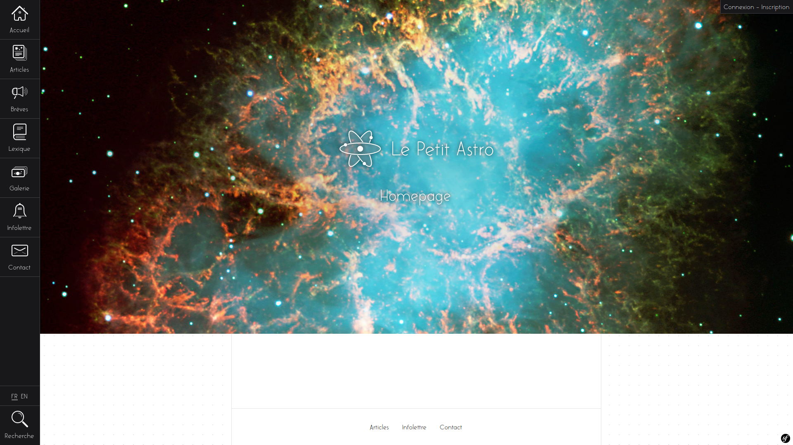

<h1 align="center">Le Petit Astro - NEO</h1>

A full refresh of my website https://lepetitastro.fr/, using my latest knowledge.

## Some technologies and packages used:

- [PHP v8.2](https://www.php.net/)
- [Symfony framework v6.3](https://symfony.com/)
- [Sulu CMS v2.5](https://sulu.io/), with:
  - [Sulu comment bundle](https://github.com/sulu/SuluCommentBundle)
  - [Sulu community bundle](https://github.com/sulu/SuluCommunityBundle)
  - [Sulu content bundle](https://github.com/sulu/SuluContentBundle)
  - [Sulu form bundle](https://github.com/sulu/SuluFormBundle)
  - [Sulu headless bundle](https://github.com/sulu/SuluHeadlessBundle)
- [Twig template engine](https://twig.symfony.com/), with:
  - [Twig components](https://ux.symfony.com/twig-component)
- [Doctrine ORM](https://www.doctrine-project.org/)
- [Webpack encore](https://github.com/symfony/webpack-encore)
- [Hotwired Turbo](https://turbo.hotwired.dev/)
- [Alpine.js](https://alpinejs.dev/)
- [Tailwind CSS](https://tailwindcss.com/)

## TODO

- Unit tests;
- Functional test;
- Deploying;
- Universal app using Flutter.
